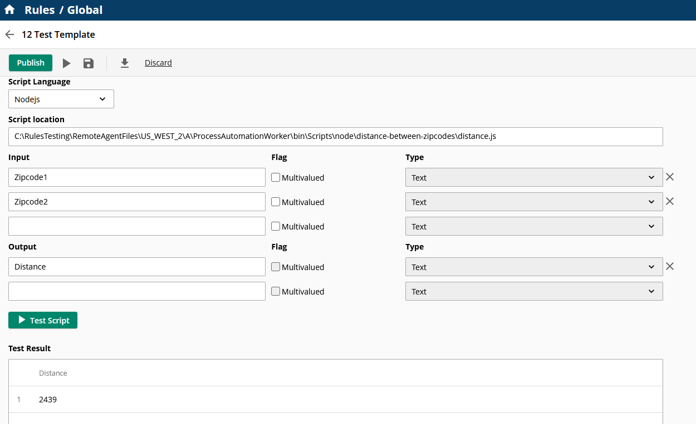
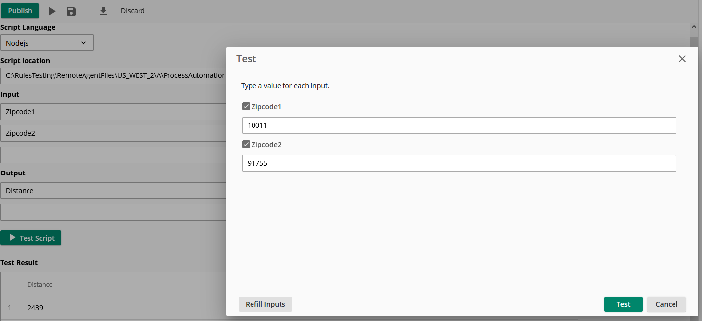
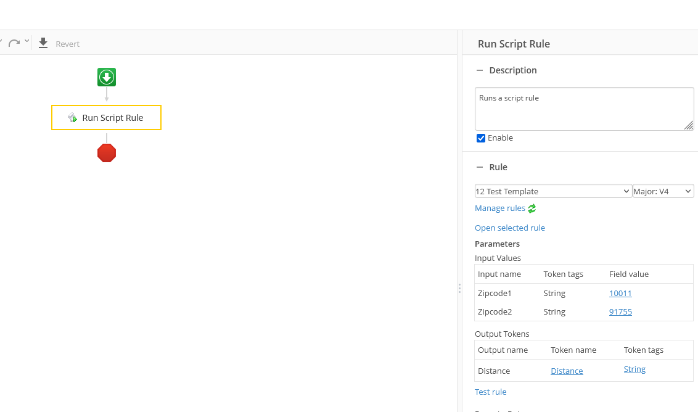

# Laserfiche Nodejs Rule script distance between zipcodes project

This project is a sample script to show how to import 3rd party npm packages in a Laserfiche Nodejs Rule script project.

## Deploy script to your remote agent

- Copy the content of the bundle output folder `\dist` to your remote agent folder
  - e.g., `C:\Program Files\Laserfiche\Server\RemoteAgent\ScriptRunner\Nodejs\script`

## Configure and test this script rule in your Laserfiche Cloud Account -> Process Automation -> Rules

- Create a new rule
  - Select the script rule type: Nodejs
  - Script location: `ProcessAutomationWorker\bin\Scripts\node\distance-between-zipcodes\distance.js`
  - Input:
    - Zipcode1
    - Zipcode2
  - Output:
    - Distance

  

## Test the rule

- Providing two zip code inputs, this script would calculate the distance between the two zip codes and return the result in miles under output parameter named "Distance"

## Test script rule in a workflow

- Run the workflow and verify the script calculate the distance between the two zip codes

