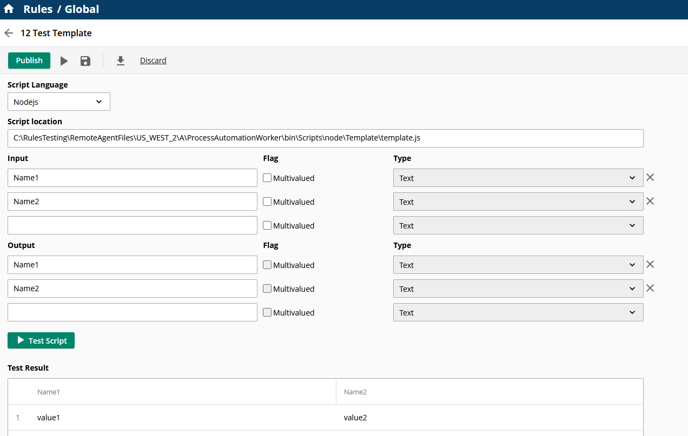
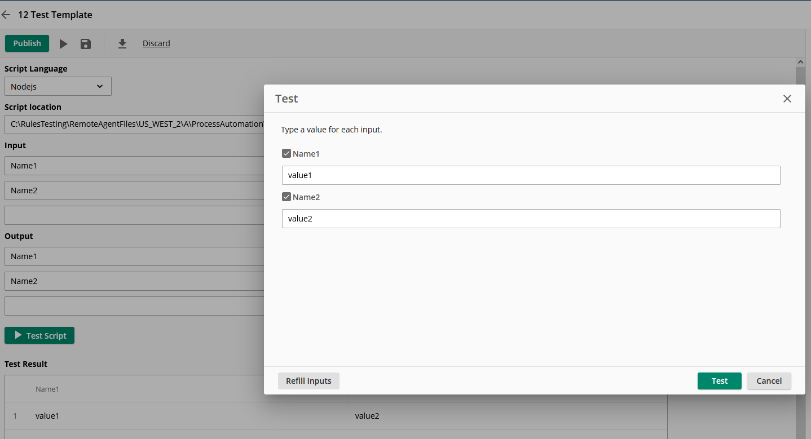
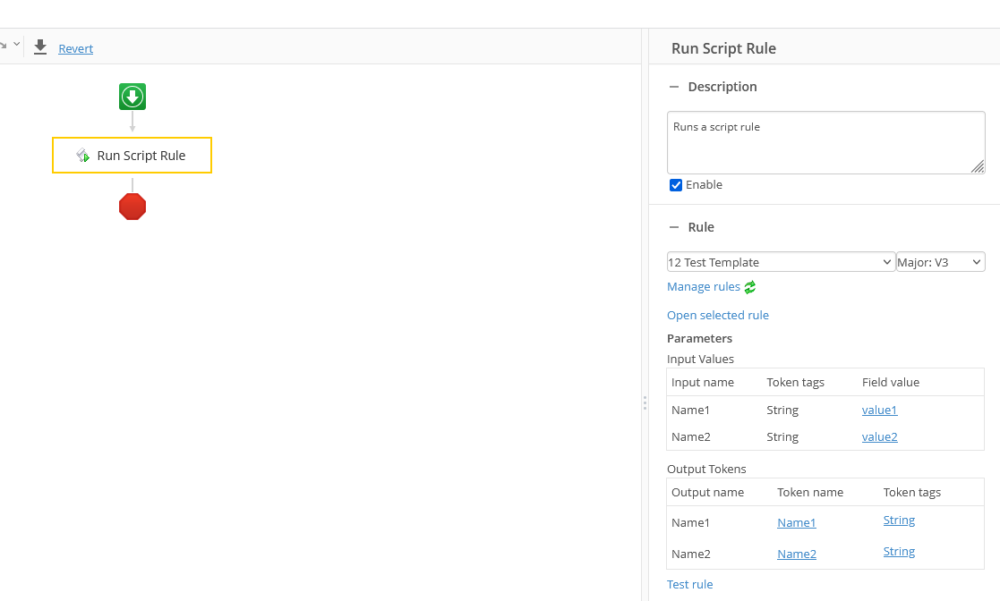

# Laserfiche Nodejs Rule script Template project

This project is a template for creating a Laserfiche Nodejs Rule script project. It contains a sample script that can be used as a starting point for creating your own script.

## Deploy script to your remote agent

- Copy the content of the bundle output folder `\dist` to your remote agent folder 
  - e.g., `C:\Program Files\Laserfiche\Server\RemoteAgent\ScriptRunner\Nodejs\script`

## Configure and test this script rule in your Laserfiche Cloud Account -> Process Automation -> Rules

- Create a new rule
  - Select the script rule type: Nodejs
  - Script location: `ProcessAutomationWorker\bin\Scripts\node\Template\template.js`
  - Input:
    - Name1
    - Name2
  - Output:
    - Name1
    - Name2

  

## Test the rule

- Providing two string inputs, this script would echo the inputs

## Test script rule in a workflow

- Run the workflow and verify the script echo the inputs

